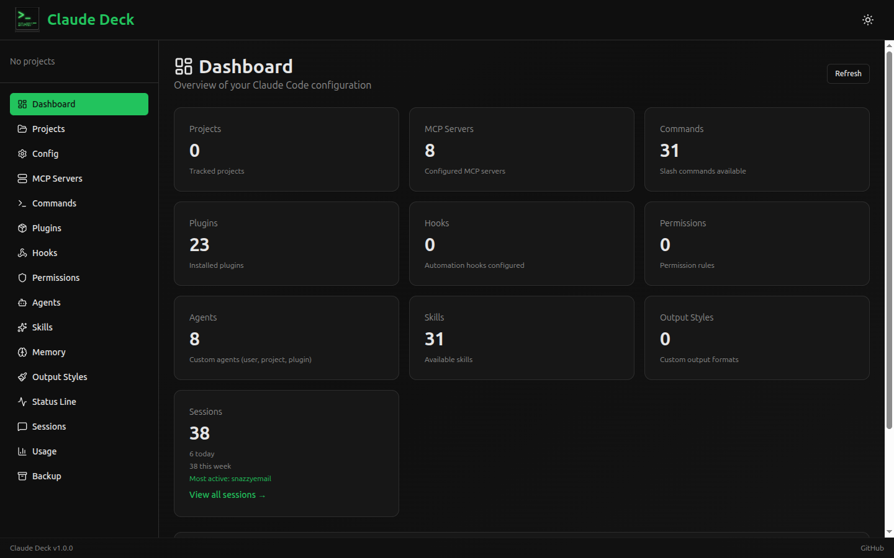
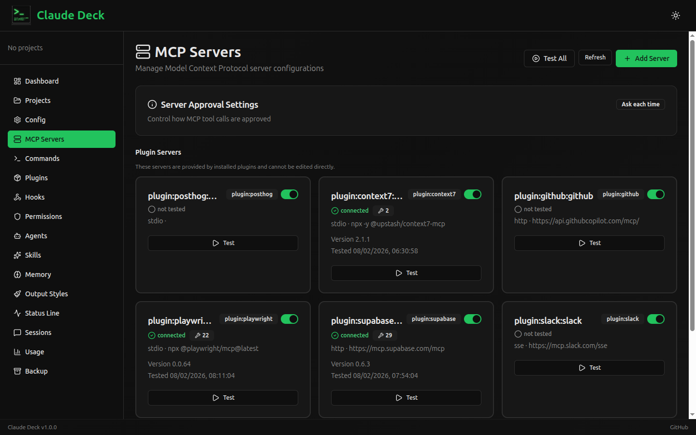
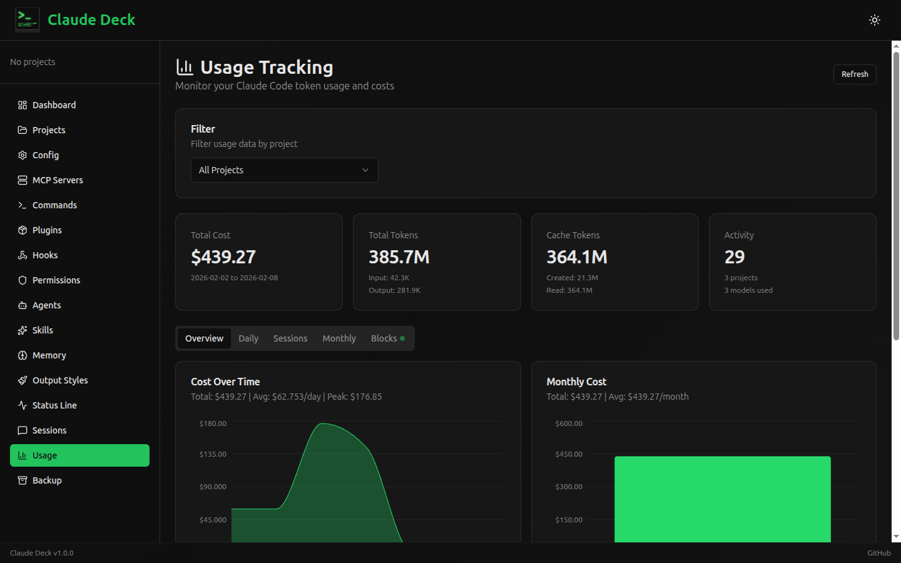
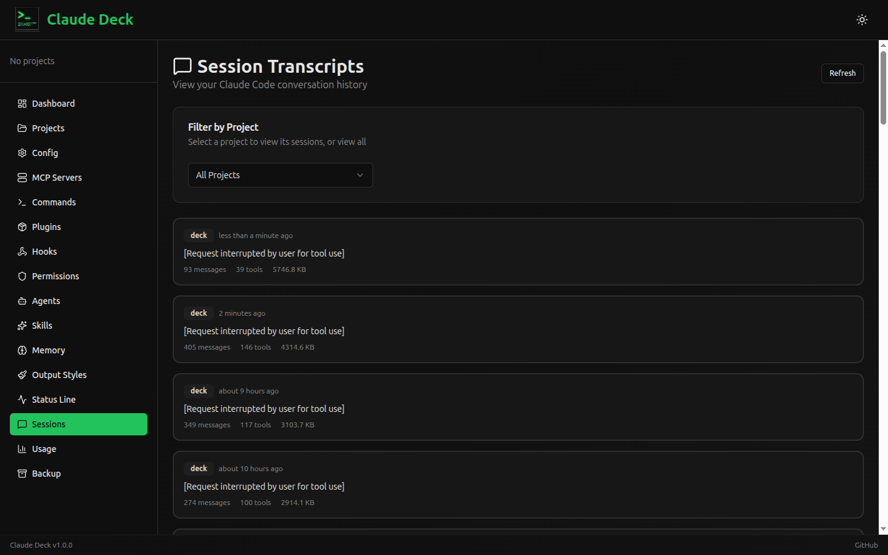

# Claude Deck

**Website**: [claudedeck.org](https://claudedeck.org)

A self-hosted web application for visualizing and managing Claude Code configuration. Provides a unified interface for managing MCP servers, plugins, slash commands, hooks, agents, permissions, usage tracking, and other Claude Code extensions.

## Features

- **Dashboard** — Overview of all Claude Code configurations with quick stats
- **Config Viewer** — Browse and inspect all configuration files (merged and individual scopes)
- **MCP Servers** — Add, edit, test, enable/disable, and manage MCP server connections with OAuth support. View tools, resources, and prompts exposed by each server. Supports stdio, HTTP, and SSE transports across user, project, plugin, and managed scopes
- **Slash Commands** — Browse, create, and edit custom commands (user and project scope)
- **Plugins** — Browse installed plugins with detail views and enable/disable toggles
- **Hooks** — Configure automation hooks by event type (PreToolUse, PostToolUse, etc.)
- **Permissions** — Visual allow/deny rule builder for tool access control
- **Agents** — Create and manage custom agent configurations
- **Skills** — Browse installed skills with dependency information
- **Memory** — View and edit Claude Code memory files
- **Output Styles** — Configure response output formats
- **Status Line** — Customize Claude Code status line display
- **Session Transcripts** — View conversation history with full message details and tool use
- **Usage Tracking** — Monitor token usage, costs, and billing blocks with daily/monthly charts
- **Backup & Restore** — Create and manage configuration backups with selective restore
- **Projects** — Discover and manage project directories

## Screenshots

| Dashboard | MCP Servers |
|-----------|-------------|
|  |  |

| Usage Tracking | Session Transcripts |
|----------------|---------------------|
|  |  |

## Tech Stack

| Layer | Technology |
|-------|------------|
| Backend | Python 3.11+ with FastAPI |
| Frontend | React 19 + TypeScript + Vite 7 |
| UI Components | shadcn/ui + Tailwind CSS |
| Charts | Recharts (via shadcn/ui) |
| Database | SQLite (async via SQLAlchemy + aiosqlite) |
| API Docs | OpenAPI (auto-generated by FastAPI) |
| Containerization | Docker + Docker Compose |

## Prerequisites

- Python 3.11+
- Node.js 18+
- npm

## Installation

1. Clone the repository:
```bash
git clone https://github.com/adrirubio/claude-deck.git
cd claude-deck
```

2. Run the install script:
```bash
./scripts/install.sh
```

This will:
- Create a Python virtual environment
- Install backend dependencies
- Install frontend dependencies
- Create required directories

## Getting Started with Docker

If you have Docker and Docker Compose installed, you can start Claude Deck with a single command:

```bash
docker compose up
```

This will:
- Build the frontend React application
- Set up the Python backend environment
- Mount your Claude Code configuration files (`~/.claude` and `~/.claude.json`)
- Expose the application at http://localhost:8000

> [!NOTE]
> The Docker setup mounts your home directory's Claude Code configuration files. Ensure these files exist or adjust the `docker-compose.yml` if necessary.

To run in detached mode:
```bash
docker compose up -d
```

## Development

Start the development servers:

```bash
./scripts/dev.sh
```

This starts:
- Backend at http://localhost:8000
- Frontend at http://localhost:5173
- API docs at http://localhost:8000/docs

### Manual Start

If you prefer to start servers manually:

**Backend:**
```bash
cd backend
source venv/bin/activate
uvicorn app.main:app --reload --port 8000
```

**Frontend:**
```bash
cd frontend
npm run dev
```

## Production Build

Build the frontend for production:

```bash
./scripts/build.sh
```

The built files will be in `frontend/dist`.

## Configuration Files

The application reads/writes these Claude Code configuration files:

| File/Directory | Scope | Description |
|---------------|-------|-------------|
| `~/.claude.json` | User | OAuth, caches, MCP servers |
| `~/.claude/settings.json` | User | User settings, permissions, disabled servers |
| `~/.claude/settings.local.json` | User | Local overrides (not committed) |
| `~/.claude/commands/` | User | User slash commands |
| `~/.claude/agents/` | User | User agents |
| `~/.claude/skills/` | User | User skills |
| `~/.claude/projects/` | User | Session transcripts & usage data |
| `.claude/settings.json` | Project | Project settings |
| `.claude/commands/` | Project | Project slash commands |
| `.mcp.json` | Project | Project MCP servers |
| `CLAUDE.md` | Project | Project instructions |

## API Endpoints

Visit http://localhost:8000/docs for interactive API documentation.

### Key Endpoints

| Category | Endpoints |
|----------|-----------|
| Health | `GET /api/v1/health` |
| Config | `GET /api/v1/config/files`, `/config/merged` |
| MCP Servers | `GET/POST/PUT/DELETE /api/v1/mcp/servers`, `/mcp/servers/{name}/test`, `/mcp/servers/{name}/toggle`, `/mcp/servers/test-all` |
| MCP Auth | `GET /api/v1/mcp/servers/{name}/auth-status`, `POST /mcp/servers/{name}/auth/start`, `GET /mcp/auth/callback` |
| MCP Approval | `GET/PUT /api/v1/mcp/approval-settings` |
| Commands | `GET/POST/PUT/DELETE /api/v1/commands` |
| Plugins | `GET /api/v1/plugins` |
| Hooks | `GET/POST/PUT/DELETE /api/v1/hooks` |
| Permissions | `GET/POST/PUT/DELETE /api/v1/permissions` |
| Agents | `GET/POST/PUT/DELETE /api/v1/agents` |
| Skills | `GET /api/v1/agents/skills` |
| Memory | `GET/PUT /api/v1/memory` |
| Output Styles | `GET/POST/PUT/DELETE /api/v1/output-styles` |
| Status Line | `GET/PUT /api/v1/statusline` |
| Sessions | `GET /api/v1/sessions`, `/sessions/{project}/{id}` |
| Usage | `GET /api/v1/usage/summary`, `/daily`, `/sessions`, `/monthly`, `/blocks` |
| Backup | `GET/POST/DELETE /api/v1/backup` |
| Projects | `GET /api/v1/projects` |
| CLI | `POST /api/v1/cli/execute` |

## Project Structure

```
claude-deck/
├── backend/
│   ├── app/
│   │   ├── main.py          # FastAPI app, CORS, lifespan
│   │   ├── config.py        # pydantic-settings configuration
│   │   ├── database.py      # Async SQLAlchemy engine + session
│   │   ├── api/v1/          # 18 route modules
│   │   ├── models/          # ORM models + Pydantic schemas
│   │   ├── services/        # 20 service files (business logic)
│   │   └── utils/           # Path and file utilities
│   ├── tests/               # pytest tests
│   ├── requirements.txt
│   └── pyproject.toml
├── frontend/
│   ├── src/
│   │   ├── App.tsx          # Routes (16 pages)
│   │   ├── components/      # Reusable UI components
│   │   │   ├── ui/          # shadcn/ui components
│   │   │   ├── layout/      # Sidebar, header, navigation
│   │   │   └── shared/      # RefreshButton, MarkdownRenderer, etc.
│   │   ├── features/        # 16 feature modules
│   │   │   ├── dashboard/
│   │   │   ├── mcp/
│   │   │   ├── commands/
│   │   │   ├── plugins/
│   │   │   ├── hooks/
│   │   │   ├── permissions/
│   │   │   ├── agents/
│   │   │   ├── skills/
│   │   │   ├── memory/
│   │   │   ├── sessions/
│   │   │   ├── usage/
│   │   │   ├── backup/
│   │   │   ├── projects/
│   │   │   ├── config/
│   │   │   ├── output-styles/
│   │   │   └── statusline/
│   │   ├── hooks/           # useApi, useProjects, useSessionsApi, useUsageApi
│   │   ├── contexts/        # ProjectContext, ThemeContext
│   │   ├── types/           # TypeScript type definitions
│   │   └── lib/             # API client, constants, utilities
│   ├── package.json
│   └── vite.config.ts
├── scripts/
│   ├── dev.sh               # Start both servers
│   ├── install.sh           # Initial setup
│   ├── build.sh             # Production build
│   └── bump-version.sh      # Version management
└── README.md
```

## Usage Tracking

The usage tracking feature parses JSONL files from `~/.claude/projects/` to provide:

- **Cost tracking** — Per-model pricing with tiered rates (200k+ tokens)
- **Daily/Monthly views** — Aggregate usage over time with charts
- **Session breakdown** — Usage per conversation session
- **Billing blocks** — 5-hour billing period tracking with active block detection
- **Burn rate** — Real-time cost projections for active sessions

## MCP Server Management

The MCP management feature supports:

- **Multiple transports** — stdio (subprocess), HTTP (streamable), and SSE
- **Multiple scopes** — User, project, plugin, and managed (enterprise) servers
- **Connection testing** — Test individual servers or all at once
- **Capability discovery** — View tools, resources, and prompts exposed by each server
- **OAuth authentication** — OAuth 2.0 flow for HTTP/SSE servers requiring auth
- **Enable/disable** — Toggle servers without removing configuration
- **Approval settings** — Configure per-server tool approval modes

## Built By

[Adrian](https://github.com/adrirubio) (13) and [Juan](https://github.com/juanrubio) during the 2025 Christmas break as a learning project — to explore open source, Claude Code, and full-stack development together.

## Acknowledgments

The session transcript viewer feature was inspired by and includes code adapted from [claude-code-transcripts](https://github.com/simonw/claude-code-transcripts) by [Simon Willison](https://simonwillison.net/). Simon's project pioneered the approach for parsing and displaying Claude Code session JSONL files.

The usage tracking feature ports algorithms from [ccusage](https://github.com/ryoppippi/ccusage) by [ryoppippi](https://github.com/ryoppippi), including the 5-hour session block identification, tiered pricing calculations, and burn rate projections.

## Disclaimer

Claude Deck is a community project and is not affiliated with or endorsed by Anthropic.

## License

MIT License
